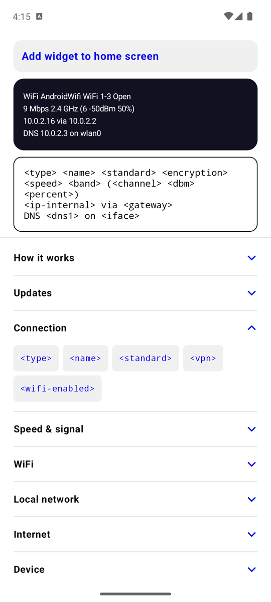

# IPeekr

A small Android home-screen widget that shows your connection at a glance:
- connection type and WiFi details (SSID, security, link speed, channel, signal)
- mobile carrier and network type (4G/5G)
- local IPv4/IPv6 addresses and VPN status
- external IP with city/country and reverse hostname

It was inspired by *IP Widget* (Dieter Thiess) but is written from scratch and is simpler. It is event-driven: no polling, and no foreground service unless you turn on instant updates.



IPeekr has a sibling app with the same look: [BLinkr](https://github.com/antoniocosta/BLinkr), a link router for social media.

- **Stack:** Kotlin, Jetpack Glance, Compose, WorkManager, DataStore.
- **SDK levels:** minSdk 26, target 36.
- **Theme:** black, white and blue (#0000EE; #8AB4F8 on #202124 in dark mode). Follows the system's light or dark mode, or pick Light or Dark at the bottom of the main screen.

## Features

The widget text is a template you type in the app, made of `<tags>` such as `<name>`, `<speed>`, `<dbm>`, `<ip-internal>`, `<ip-external>`. There is one tag for every field IP Widget can show (type, name, standard, speed, channel, dBm, ASU, percent, frequency, channel width, encryption, BSSID, AP vendor/capabilities, IPv4/IPv6, netmask, CIDR, broadcast, gateway, DHCP + lease, DNS, interface, MAC/vendor, VPN, external IP, city/country/flag, hostname, battery, WiFi on/off), grouped in the app.
- Fields that never apply at the same time share one tag: `<name>` is the SSID on WiFi and the operator on mobile, `<standard>` is "WiFi 6" or "5G", and `<speed>`, `<dbm>`, `<asu>`, `<percent>` follow the active connection.
- Lines whose tags are all empty are hidden; long lines wrap.

Style: font (built-in families), size, bold, line spacing (a multiple of the size), and either system (Material You) colours or your own text and background colour with opacity. One widget, resizable to any size. The app is also the widget's settings screen (launcher long-press).

AP/device vendor names come from `app/src/main/assets/oui.tsv.gz`, built by `scripts/gen-oui.py` from Wireshark's `manuf` list.

## How it works

Updates are event-driven, with a slow schedule as a backup ([`Triggers.kt`](app/src/main/java/net/uncorp/ipeekr/refresh/Triggers.kt)):

| Trigger | When | Refresh |
|---|---|---|
| Connection type changes | A system job (`JobScheduler` with a required `NetworkRequest`) waits for a different kind of connection than the current one, e.g. WiFi → mobile. It runs even after the app process has been killed, and VPNs are handled. A network `PendingIntent` can't be used: Android drops it 5 s after each delivery. | normal |
| Instant updates (opt-in switch) | A foreground service (`specialUse`) listens to every network change, including a switch between two WiFi networks, and refreshes on unlock. Android requires a notification while it runs; its channel is silent and can be hidden. | normal |
| Tap the widget / open the app | right away | forced |
| Periodic job | every 15 minutes (WorkManager's minimum) | normal |
| Reboot / app update | re-registers the triggers, then refreshes once | normal |

Each refresh ([`Refresher.kt`](app/src/main/java/net/uncorp/ipeekr/refresh/Refresher.kt)) runs in two steps:
1. **Local data** (type, SSID, speed, signal, local IPs, DNS, …) is read from the system and the widget updates right away.
2. **External data** (public IP, city/country, hostname) comes from `ifconfig.co`, with `ipify` + `db-ip` + reverse DNS as the fallback. It is cached per network and fetched again only when the network changes, when the cache is over 30 minutes old, or on a forced refresh.

## Limits

- **Signal and speed** (dBm, %, Mbps) are not live. They are as of the last trigger, so at most about 15 minutes old.
- **A lost network** shows up on the next periodic run or tap: the network trigger fires when a network comes up, not when one is lost.
- **Release builds don't log** (R8 strips `Log.v/d/i/w`).

## Develop

The scripts use the SDK, JDK 21 and emulator from an `android-dev-toolkit` folder next to this repo (override with `TOOLKIT=`). With your own Android SDK and JDK 21, plain `./gradlew assembleDebug` works too.

```sh
scripts/dev.sh run        # build, install on emulator-5554, launch
scripts/dev.sh test       # unit tests
scripts/dev.sh phone      # release build (R8, ~3 MB) installed on the USB phone, user 0
scripts/dev.sh widget     # emulator home screen, to add the widget
```

## Icon

The icon source is `art/ipeekr.svg` (512px pixel art). `scripts/gen-icon.py` regenerates the launcher drawables from it.
